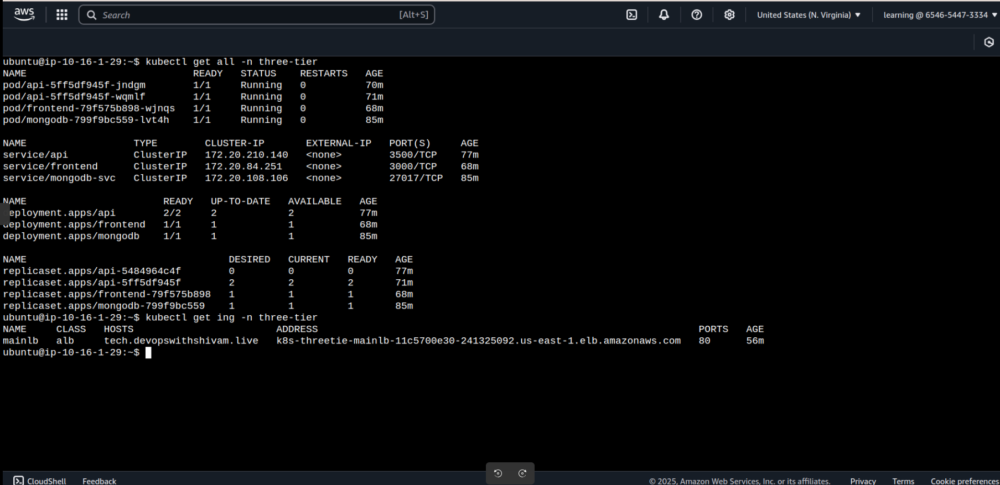

# DevOps Three-Tier MERN Application

This project demonstrates a complete DevSecOps implementation for a MERN stack application using modern cloud-native tools and practices.


## Architecture Overview

A full-stack web application deployed on AWS EKS with automated CI/CD pipeline, monitoring, and security scanning.

## Tech Stack

- **Frontend**: React.js
- **Backend**: Node.js/Express
- **Database**: MongoDB
- **Infrastructure**: AWS (EKS, ECR, ELB, EC2)
- **IaC**: Terraform
- **CI/CD**: Jenkins, ArgoCD
- **Security**: SonarQube
- **Monitoring**: Prometheus, Grafana

## Project Structure

```
├── Application-Code/          # MERN application source code
├── Jenkins-Pipeline-Code/     # CI/CD pipeline scripts
├── Jenkins-Server-TF/         # Terraform scripts for Jenkins setup
├── Kubernetes-Manifests-Files/# K8s deployment manifests
└── Terraform/                 # Infrastructure as Code
```

## Implementation Steps

### 1. Infrastructure Setup

Set up the foundational AWS infrastructure using Terraform:
- EKS cluster with worker nodes
- VPC with proper networking
- Security groups and IAM roles
- Modular approach for reusability


### 2. Jenkins Server Configuration

Deploy Jenkins on AWS EC2:
- t3.large instance with Elastic IP
- Automated dependency installation via user data script
- Required plugins: Docker, AWS CLI, Node.js, SonarQube

### 3. SonarQube Integration

Configure code quality analysis:
- SonarQube server running on port 9000
- Generate authentication tokens for Jenkins integration
- Set up quality gates for both frontend and backend


### 4. CI Pipeline with Jenkins

Automated build and deployment pipeline:
- Source code checkout from GitHub
- Code quality analysis with SonarQube
- Docker image build and push to ECR
- Automated testing and security scans

**Required Jenkins Configurations:**
- AWS credentials
- GitHub tokens
- SonarQube integration
- Docker registry access

### 5. Jump Server Setup

EC2 instance for EKS cluster management:
- Deployed in same VPC as EKS cluster
- Pre-installed tools: kubectl, eksctl, AWS CLI
- Proper IAM roles and service accounts for AWS Load Balancer Controller

**Connect to EKS cluster:**
```bash
aws eks update-kubeconfig --name <cluster-name> --region <region-name>
```

### 6. ArgoCD Deployment

GitOps continuous delivery:
- Installed via Helm on EKS cluster
- Application manifests for frontend, backend, and database
- Automated deployment from Git repository
- Ingress configuration for external access

### 7. Monitoring Stack

Observability with Prometheus and Grafana:
- Helm-based installation on EKS
- Custom dashboards for application metrics
- Pod and cluster monitoring
- Alerting rules for critical events

## Getting Started

1. **Clone the repository**
   ```bash
   git clone <repository-url>
   cd devops-mern-project
   ```

2. **Deploy infrastructure**
   ```bash
   cd Terraform
   terraform init
   terraform plan
   terraform apply
   ```

3. **Configure Jenkins**
   - Access Jenkins at `http://<jenkins-ip>:8080`
   - Install required plugins
   - Add credentials and configure tools

4. **Set up monitoring**
   ```bash
   helm install prometheus prometheus-community/kube-prometheus-stack
   helm install grafana grafana/grafana
   ```

## Key Features

- **Infrastructure as Code**: Complete AWS infrastructure managed with Terraform
- **Automated CI/CD**: Jenkins pipelines for build, test, and deployment
- **Security Integration**: SonarQube for static code analysis
- **GitOps Deployment**: ArgoCD for automated application deployment
- **Container Orchestration**: Kubernetes on AWS EKS
- **Monitoring & Observability**: Prometheus and Grafana integration
- **Load Balancing**: AWS Application Load Balancer integration

## Prerequisites

- AWS Account with appropriate permissions
- Terraform installed
- kubectl and eksctl
- Docker
- Git

## Monitoring Access

- **Prometheus**: `http://<prometheus-endpoint>`
- **Grafana**: `http://<grafana-endpoint>`
- **Jenkins**: `http://<jenkins-ip>:8080`
- **SonarQube**: `http://<sonarqube-ip>:9000`


 




 


